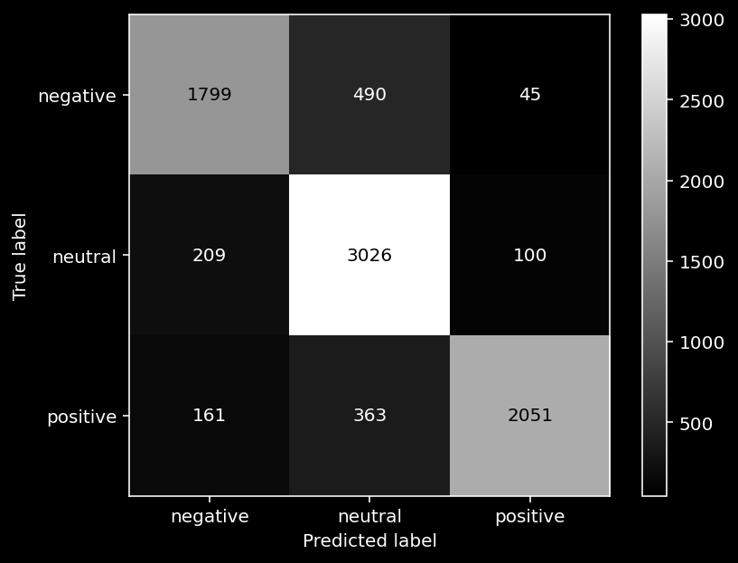

# Tweet Sentiment Classifier

<h4>Blake Rayvid - <a href=https://github.com/brayvid>https://github.com/brayvid</a></h4>
Flatiron School Data Science Bootcamp Phase 3 Project

## Business problem
<h3><u>Brand reputation management</u></h3>
<h4>Monitor brand perception by correctly classifying new tweets as positive, negative or neutral.</h4>
<ul>
<li>Analyze negative feedback for insights into product weaknesses and use this to drive improvements.
<li>Identify accounts with consistent positive sentiment and offer to collaborate.
<li>Time launches of new products during periods of high positive sentiment.
</ul>

## Dataset
<h4><a href="https://www.kaggle.com/datasets/yasserh/twitter-tweets-sentiment-dataset">https://www.kaggle.com/datasets/yasserh/twitter-tweets-sentiment-dataset</a></h4>
<ul>
<li>Three classes: <code>positive</code>, <code>negative</code>, <code>neutral</code> in column called <code>sentiment</code>.
<li>27,000 tweets formatted as strings in <code>text</code> column.
<li><code>selected_text</code> is an additional column containing the substring of each tweet relevant to classification.
</ul>

## Results
<h4>Support Vector Classifier (SVC): <a href="https://scikit-learn.org/stable/modules/generated/sklearn.svm.SVC.html">https://scikit-learn.org/stable/modules/generated/sklearn.svm.SVC.html</a></h4>
<table>
<tr>
<td>Label</td>
<td>Precision</td>
<td>Recall</td>
</tr>
<tr>
<td><code>negative</code></td>
<td>83%</td>
<td>77%</td>
</tr>
<tr>
<td><code>neutral</code></td>
<td>78%</td>
<td>91%</td>
</tr>
<tr>
<td><code>positive</code></td>
<td>93%</td>
<td>80%</td>
</tr>
</table>

## Next steps
<ul>
<li>Try Word2Vec semantic embedding instead of frequency-based TF-IDF.
<li>Investigate dimensionality reduction with UMAP or t-SNE.
<li>Deploy to a web service to classify new tweets in real time.
</ul>

##
<h4><a href="https://github.com/brayvid/tweet-sentiment-classifier/blob/main/slides.pdf">slides.pdf</a></h4>
